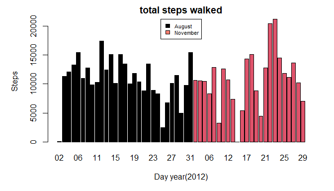
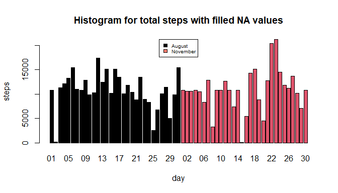
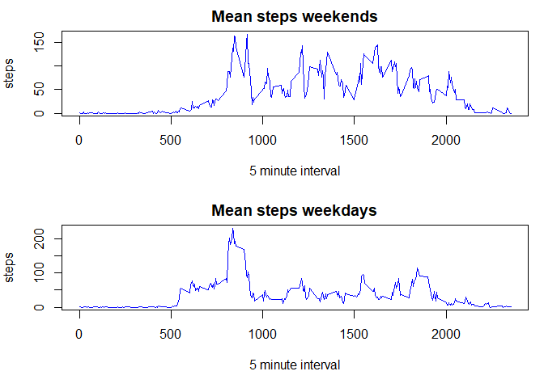

Reproducible Rresearch Project 1
================================

Loading and preprocessing the data
----------------------------------

Initially the file must be downloaded & unzipped, after this process is
done read.table function is used to save the data set into a new
variable: DataFrame. After the data frame is saved NA values are
deleted, but before this, the original data is saved in
“DataFrameOriginal”.

The final process of this section is changing the classes for each
variable in the data set:

-   dates as Dates
-   steps as numeric
-   interval as factor

<!-- -->

      ## Get the data
      URL <- 
      "https://d396qusza40orc.cloudfront.net/repdata%2Fdata%2Factivity.zip"

      download.file(URL,"projectData.zip",method = "curl")

      ## Unzip the file
      unzip("projectData.zip")

      ## Read the data
      DataFrame <- read.table(file = "activity.csv",header = TRUE,
                    sep = ",",colClasses = "character" ,na.strings = "NA")
      
      ## Delete data with NA
      DataFrameOriginal <- DataFrame
      DataFrame <- DataFrame[!is.na(DataFrame$steps),]

      ## Put every data in their corresponding format
      DataFrame[,1] <- as.numeric(DataFrame[,1])
      DataFrame[,2] <- as.Date(DataFrame[,2],"%Y-%m-%d")
      DataFrame[,3] <- as.factor(DataFrame[,3])

Question 1: What is mean total number of steps taken per day?
-------------------------------------------------------------

The initial step for answering this question is to calculate the total
number of steps that the individual took per day.

      ## Calculate total steps each day
      totalSteps <- with(DataFrame,tapply(steps,date,
                         FUN = function(x){sum(x,na.rm = TRUE)}))

      totalSteps <- data.frame(steps=as.vector(totalSteps),
                               dates=names(totalSteps))

### Create a histogram with total steps per day

Having the total number of steps per day it is easy to create a
histogram showcasing this values. To make it more understandable a new
column indicating the month is added to the data set and the plot is
divided by the month of the lecture and each column represents a day of
that month.

      ## Add month column
      totalSteps["month"]<-""

      ## Obtain the dates for the histogram
      dates <- gsub("^2012-","",totalSteps$dates)
      dates <- gsub("-","/",dates)

      ## Add the month for wach day
      totalSteps[grep("^10",dates),3] <- "August"
      totalSteps[grep("^11",dates),3] <- "November"

      totalSteps$month <- as.factor(totalSteps$month)

      dates <- gsub("^10/","",dates)
      dates <- gsub("^11/","",dates)

      ## Plot
      par(mfrow=c(1,1),mar=c(5,5,2,2))
      
      barplot(height = totalSteps$steps,names.arg = dates,
              xlab = "Day year(2012)",ylab="Steps",col=totalSteps$month)
      
      title(main="total steps walked")
      
      legend(x = "top",legend = levels(totalSteps$month),
             fill = c("black","salmon"),cex=0.7)

### Report the mean and median of steps

Mean and median values are calculated for the complete set of days.

      ##Mean and Median
      meanSteps <- mean(totalSteps$steps)
      medianSteps <- median(totalSteps$steps)

The mean value is: 1.076618910^{4} steps per day.  
The median value is: 1.076510^{4} steps.

Question 2: What is the average daily activity pattern?
-------------------------------------------------------

In order to make a lines plot with the average number of steps per 5
minute interval it is required to do some pre processing of the data.
First we need to calculate the mean for each interval:

      intervalMeans <- tapply(DataFrame$steps,DataFrame$interval,mean)

### time series plot

After this is done we are ready to plot the data:

      ## Time series plot
      intervalMeans <- as.data.frame(tapply(DataFrame$steps,
                                            DataFrame$interval,mean))

      intervalMeans["interval"] <- row.names(intervalMeans)
      
      intervalMeans <- intervalMeans[order(
                                    as.numeric(intervalMeans$interval)),]
      
      names(intervalMeans) <- c("steps","interval")
      
      plot(y = intervalMeans$steps,x=intervalMeans$interval,
           type = "l",xlab ="Interval (min)" ,ylab ="Steps")
      
      title(main="Mean steps per 5 min interval")

### 5 Minute interval with most activity

For this task it is compared both the total number of steps per interval
and the mean number of steps to find out which 5 minute interval has the
greatest activity (in steps) among the 288 groups.

      ## 5 minute interval with most steps
      intervalTotal <- tapply(DataFrame$steps,DataFrame$interval,sum)

      maxSteps <- names(intervalTotal)[
        order(intervalTotal,decreasing = TRUE)[[1]]]
      
      maxMean <- intervalMeans$interval[
        order(intervalMeans$steps,decreasing = TRUE)[[1]]]
      
      maxMeanValue <- intervalMeans$steps[
        order(intervalMeans$steps,decreasing = TRUE)[[1]]]
      maxTotalValue <- intervalTotal[
        order(intervalTotal,decreasing = TRUE)[[1]]]
      
      inter<-as.character(as.numeric(maxMean)+5)
      
      maxSteps

    ## [1] "835"

      maxMean

    ## [1] "835"

The 5 minute interval with the highest activity is: \[835-840) with
206.1698113 steps in average and 1.092710^{4} steps in total.

Question 3: Imputing missing values
-----------------------------------

### Calculate the number of missing values

To calculate this value is.na() funciton is used and sum() function.

      ## Claculate numbers of NA values
      naNumbers <- sum(is.na(DataFrameOriginal$steps))
      naNumbers

    ## [1] 2304

### Strategy for filling the NA values

The selected strategy is to assign the mean steps value of the 5 minute
interval to the corresponding NA value. For this we will use the data
frame that contained the mean steps for each interval, and then with a
double for loop add the mean values to the missing fields in the
original data frame.

### Create a new data frame without missing values

Following the strategy previously explained:

      ## Asign values to NA fields
      naFields <- is.na(DataFrameOriginal$steps)
      naIntervals <- unique(DataFrameOriginal$interval[naFields])
      temporal <- data.frame(steps=intervalMeans$steps,
                             interval=intervalMeans$interval)
      NaValues <- subset(x = temporal, temporal$interval %in% naIntervals)

      ## Create data frame with no NA values
      DataFrameComplete <- DataFrameOriginal

    ## Replace missing values by mean of the intervals
    for(i in 1:length(as.vector(DataFrameOriginal$steps))){
      if(is.na(DataFrameOriginal$steps[i])==TRUE){
        for(j in 1:288){
          if(DataFrameOriginal$interval[i]==NaValues$interval[j]){
            DataFrameComplete[i,1] <- NaValues$steps[j]
            break
          }
        }
      }else{
        DataFrameComplete[i,1] <- DataFrameOriginal$steps[i]
      }
    }

      ## Modify the class of each variable
      DataFrameComplete$steps <- as.numeric(DataFrameComplete$steps)
      DataFrameComplete$date <- as.Date(DataFrameComplete$date,"%Y-%m-%d")

      head(DataFrameComplete)

    ##       steps       date interval
    ## 1 1.7169811 2012-10-01        0
    ## 2 0.3396226 2012-10-01        5
    ## 3 0.1320755 2012-10-01       10
    ## 4 0.1509434 2012-10-01       15
    ## 5 0.0754717 2012-10-01       20
    ## 6 2.0943396 2012-10-01       25

      sum(is.na(DataFrameComplete$steps))

    ## [1] 0

Now we are sure that none of the values in the data frame is NA

### Histogram, median and mean

Now its time to create a histogram for the new data frame which shows
the number of steps per day. Also mean and median will be recalulated:

    ## Claculate both median and mean for each day
    newTotal <- with(DataFrameComplete,tapply(as.numeric(steps),date,sum))
    newMean <- mean(newTotal)
    newMedian <- median(newTotal)

    ##Remove year and month from the dates
    newTotal <- as.data.frame(newTotal)
    newTotal["date"] <- row.names(newTotal)

    ## Create the month variable indicating if it is novermber or august
    newTotal$date <- gsub("^2012-","",newTotal$date)
    newTotal["month"] <- ""
    newTotal[grep("^10",newTotal$date),3] <- "August"
    newTotal[grep("^11",newTotal$date),3] <- "November"

    ## Remove the month from the date
    newTotal$date <- gsub("^10-","",newTotal$date)
    newTotal$date <- gsub("^11-","",newTotal$date)

    ## class the month variable as factor
    newTotal$month<-as.factor(newTotal$month)
    names(newTotal)<-c("steps","date","month")

    ## plot the new histogram
    barplot(height = newTotal$steps,names.arg = newTotal$date,
            xlab="day",ylab="steps",col=newTotal$month)
    title(main="Histogram for total steps with filled NA values")
    legend(x = "top",legend = levels(newTotal$month),fill=c("black","salmon"),cex=0.6)

The new mean is:1.076618910^{4}  
The old mean is:1.076618910^{4}

The new median is:1.076618910^{4}  
The old median is:1.076510^{4}

We can analyze that the mean has not changed since mean values were
added, so their contribution to the mean computation is null. However
the median does change because new data is being added to the
computation, making the middle value to change. However the difference
is not great, which may suggest that not including this NA values would
not affect greatly the study. However more detailed studies on NA
registers should be done in order to be sure that removing NA values
does not affect or that there isn’t any trend in NA registers.

Question 4: Are there differences in activity patterns between weekdays and weekends?
-------------------------------------------------------------------------------------

### Create a new factor variable in the data set

A new variable should be added in order to tell whether the register was
done in a weekday or a weekend.

      ## Evaluate if it is a weekday or weekend and add column
      DataFrameComplete["day.Type"]<-as.factor(
        ifelse(weekdays(DataFrameComplete$date)=="Saturday"|
                 weekdays(DataFrameComplete$date)=="Sunday",
               "Weekend","Weekday"))

      ## Create 2 data frames one for weekdays and other for weekends
      weekdays<-subset(DataFrameComplete,
                       DataFrameComplete$day.Type=="Weekday")
      weekends<-subset(DataFrameComplete,
                       DataFrameComplete$day.Type=="Weekend")

      ## Calculate mean for each 5 minute interval
      weekdaysMean <- as.data.frame(with(weekdays,tapply(steps,
                                                  as.factor(interval),mean)))
      weekdaysMean["interval"] <- row.names(weekdaysMean)
      weekdaysMean <- weekdaysMean[order(as.numeric(weekdaysMean$interval)),]
      names(weekdaysMean) <- c("steps","interval")

      weekendsMean <- as.data.frame(with(weekends,tapply(steps,
                                                  as.factor(interval),mean)))
      weekendsMean["interval"] <- row.names(weekendsMean)
      weekendsMean <- weekendsMean[order(as.numeric(weekendsMean$interval)),]
      names(weekendsMean) <- c("steps","interval")
      
      head(DataFrameComplete)

    ##       steps       date interval day.Type
    ## 1 1.7169811 2012-10-01        0  Weekday
    ## 2 0.3396226 2012-10-01        5  Weekday
    ## 3 0.1320755 2012-10-01       10  Weekday
    ## 4 0.1509434 2012-10-01       15  Weekday
    ## 5 0.0754717 2012-10-01       20  Weekday
    ## 6 2.0943396 2012-10-01       25  Weekday

Make a plot
-----------

      ## Plot

      # set parameters for panel plots
      par(mfcol=c(2,1),mar=c(5,4,2,1))

      # plot weekends 
      plot(x = as.numeric(weekendsMean$interval),y = weekendsMean$steps,
           col="blue",type = "l", xlab = "5 minute interval" ,ylab = "steps")
      title(main="Mean steps weekends")

      # plot weekdays
      plot(x = as.numeric(weekdaysMean$interval),y = weekdaysMean$steps,
           col="blue",type="l",xlab = "5 minute interval" ,ylab = "steps")
      title(main="Mean steps weekdays")

Thanks to the graph we can see that the individual has more activity on
weekends, this is seen as there are more peaks (mean number of steps)
during the whole day than in the weekdays. However the begining and end
of the day have similar trends which could suggest the waking and
sleeping hours of the individual. The next step would be to try identify
which acitivy caused the reduced walking in weekdays (probably work).
